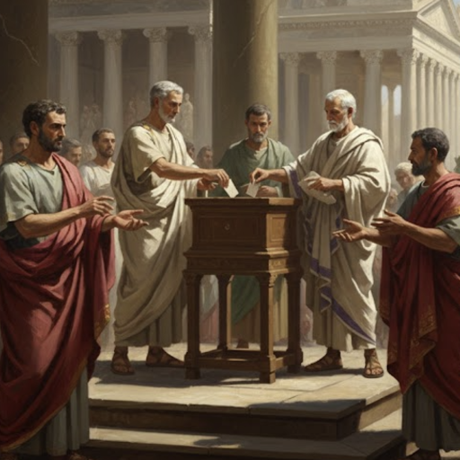

# Aristocratic Republic

An Old World mod that adds a republic government system with periodic elections every 10 turns.

Power shared is power contested. Every 10 turns, elevate a new family head to the throne — or keep your current leader, if the other families will allow it.

## Rules

- Elections occur every 10 turns starting at turn 10
- Candidates are family heads who are adult, healthy, and not the current leader
- Each candidate must come from a different family
- The current leader may run for re-election, but only if all families have at least Cautious opinion
- The winning candidate's family gains +20 opinion for 20 turns
- All other families lose 20 opinion for 20 turns
- New leaders receive a legitimacy bonus that scales with game progress: small in the early game, large in the late game
- Re-elected leaders receive a smaller legitimacy bonus than new leaders
- Leader changes use the Seize Throne mechanism, so there are no heir-bypass penalties

## Legitimacy Scaling

| Turns | New Leader | Re-election |
|-------|-----------|-------------|
| 10–30 | +8 | +5 |
| 31–60 | +15 | +10 |
| 61–100 | +25 | +15 |
| 101–150 | +35 | +20 |
| 151+ | +45 | +25 |

## Installation

Subscribe on [Steam Workshop](https://steamcommunity.com/sharedfiles/filedetails/?id=3661673108) or [mod.io](https://mod.io/g/oldworld/m/aristocratic-republic), or copy the mod folder to your Old World mods directory manually.

## Compatibility

- Single-player and multiplayer
- No DLC required
- XML-only — no C# code, compatible with other mods
